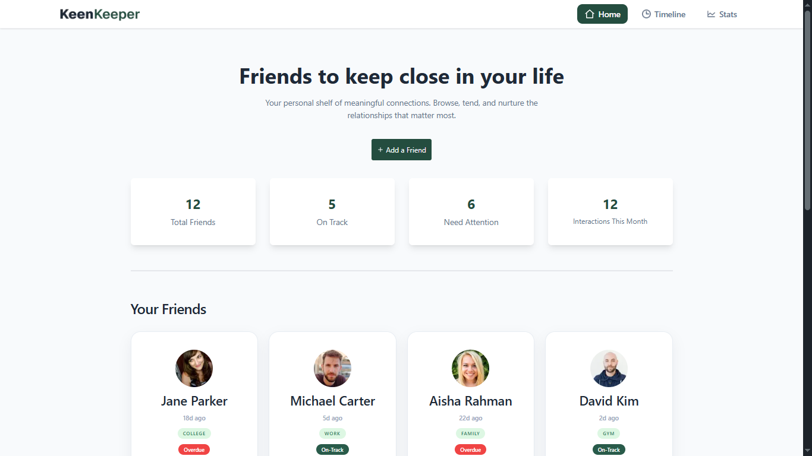
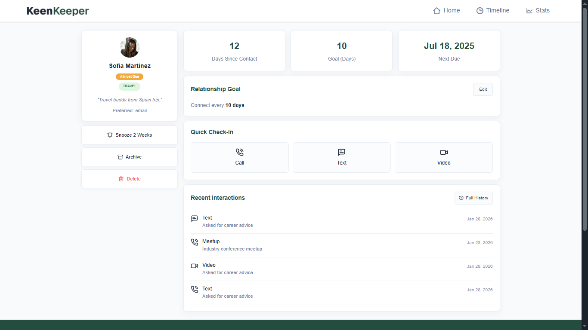
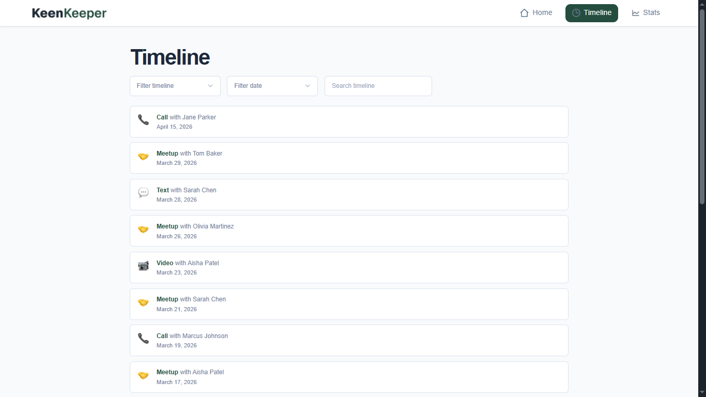
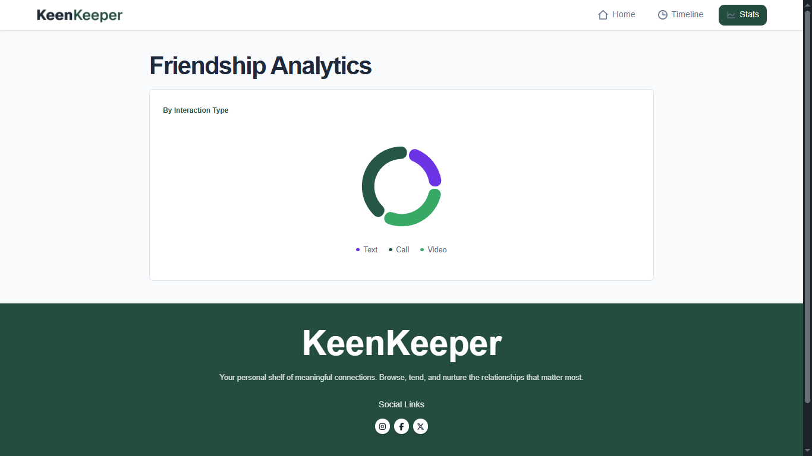

<div align="center">

# KeenKeeper

### Nurture Meaningful Friendships With Clarity and Consistency

A polished relationship tracker built with Next.js and React, where users can browse a curated friends directory, open detailed relationship profiles, log quick check-ins, review a searchable timeline, and visualize communication habits through friendship analytics.

[](https://keen-keeper2026.vercel.app/)
[](https://nextjs.org/)
[](https://react.dev/)
[](https://tailwindcss.com/)
[](https://daisyui.com/)
[](https://recharts.org/)
[](https://keen-keeper2026.vercel.app/)

</div>

---

## Preview

<p align="center">
  
</p>

<p align="center">
  
</p>

<p align="center">
  
</p>

<p align="center">
  
</p>

> **Live Site:** [https://keen-keeper2026.vercel.app/](https://keen-keeper2026.vercel.app/)

---

## Features

| Feature | Description |
| :--- | :--- |
| Browse Friends Directory | Explore a clean, responsive friend list loaded from a local JSON dataset |
| Friend Detail Pages | Open individual profiles with contact cadence, due date, tags, bio, and recent interaction context |
| Quick Check-In Actions | Log call, text, or video interactions directly from a friend profile |
| Timeline Tracking | Review interaction history from a dedicated timeline page with seeded and newly added entries |
| Search, Filter, and Sort | Narrow timeline results by interaction type, search term, and date ordering |
| Friendship Analytics | Visualize call, text, and video activity in a responsive pie chart |
| Local Storage Persistence | Timeline entries persist in the browser through `localStorage` and stay synced across views |
| Toast Feedback | Instant success feedback appears when a new quick check-in is recorded |
| Responsive Navigation | Mobile view now uses a dedicated hamburger dropdown while the desktop navbar remains unchanged |
| Friendly Loading and Empty States | Friends list, timeline, and analytics views include graceful loading, error, and empty-state handling |

---

## Tech Stack

<div align="center">

| Technology | Purpose |
| :---: | :---: |
| **Next.js 16** | App Router structure, routing, image optimization, and production builds |
| **React 19** | Interactive UI, client components, and local state handling |
| **Tailwind CSS 4** | Utility-first styling and responsive layout control |
| **DaisyUI 5** | Base UI primitives used alongside Tailwind |
| **React Icons** | Iconography for navigation, actions, and status cues |
| **React Toastify** | Success toasts for quick interaction logging |
| **React Spinners** | Loading indicators for async UI states |
| **Recharts** | Friendship analytics chart rendering |
| **Local JSON Data** | Friend records served from `public/data.json` |
| **Browser Local Storage** | Persistence for timeline interaction history |
| **Vercel** | Deployment and hosting |

</div>

---

## Getting Started

### Prerequisites

- **Node.js** Current LTS recommended
- **npm** Included with Node.js

### Installation

1. **Clone the repository**

   ```bash
   git clone <your-repository-url>
   cd PHA7-Keen-Keeper
   ```

2. **Install dependencies**

   ```bash
   npm install
   ```

3. **Start the development server**

   ```bash
   npm run dev
   ```

4. **Open in your browser**

   Navigate to `http://localhost:3000` to view the app locally.

---

## Project Structure

```text
PHA7-Keen-Keeper/
|-- public/
|   |-- ChartLine.png
|   |-- clock.png
|   |-- data.json
|   |-- logo.png
|   |-- Preview1.png
|   |-- Preview2.png
|   |-- Preview3.png
|   |-- Preview4.png
|   `-- Preview5.png
|-- src/
|   |-- app/
|   |   |-- friends/
|   |   |   |-- [id]/
|   |   |   |   `-- page.jsx
|   |   |   `-- page.jsx
|   |   |-- stats/
|   |   |   `-- page.jsx
|   |   |-- timeline/
|   |   |   `-- page.jsx
|   |   |-- favicon.ico
|   |   |-- globals.css
|   |   |-- layout.jsx
|   |   |-- not-found.jsx
|   |   `-- page.jsx
|   |-- assets/
|   |   |-- call.png
|   |   |-- ChartLine.png
|   |   |-- clock.png
|   |   |-- logo.png
|   |   |-- logo-xl.png
|   |   |-- meetup.png
|   |   |-- text.png
|   |   |-- video.png
|   |   `-- ui/
|   |       |-- KinKeeper.fig
|   |       `-- KinKeeper.penpot
|   |-- components/
|   |   |-- friends/
|   |   |   `-- FriendDetails.jsx
|   |   |-- home/
|   |   |   |-- Banner.jsx
|   |   |   |-- FriendsGrid.jsx
|   |   |   `-- YourFriends.jsx
|   |   |-- stats/
|   |   |   `-- FriendshipAnalytics.jsx
|   |   |-- timeline/
|   |   |   `-- Timeline.jsx
|   |   |-- Footer.jsx
|   |   |-- Navbar.jsx
|   |   `-- ToastProvider.jsx
|   `-- lib/
|       |-- friend-ui.js
|       |-- friends.js
|       `-- timeline.js
|-- package.json
`-- README.md
```

---

## Design Highlights

- Calm, polished interface focused on relationship care instead of dashboard clutter
- Card-based friend browsing with clear status badges, tags, and spacing hierarchy
- Dedicated detail layout that surfaces cadence goals, next due dates, and quick actions
- Timeline page that balances search tools with simple, readable interaction records
- Mobile-friendly hamburger navigation for smaller screens without altering the desktop navbar
- Soft neutral backgrounds and green accent styling that reinforce the app's personal, intentional tone

---

## Data Source

This project uses a local friends dataset stored in:

```text
public/data.json
```

Each friend entry includes:

- ID
- Name
- Profile picture URL
- Email
- Days since contact
- Relationship status
- Tags
- Short bio
- Contact goal in days
- Next due date

Timeline data is seeded in `src/lib/timeline.js` and persisted in the browser under:

```text
keenkeeper.timelineEntries
```

---

## Deployment

The application is deployed on **Vercel**:

**Live URL:** [https://keen-keeper2026.vercel.app/](https://keen-keeper2026.vercel.app/)

---

<div align="center">

**If you found this project useful, consider giving it a star!**

Made with Next.js, React, Tailwind CSS, DaisyUI, React Toastify, and Recharts

</div>
